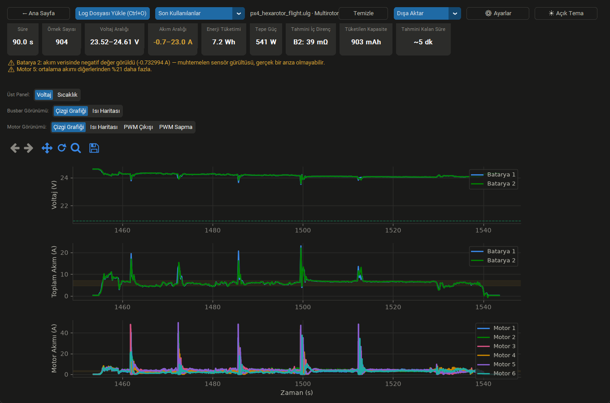
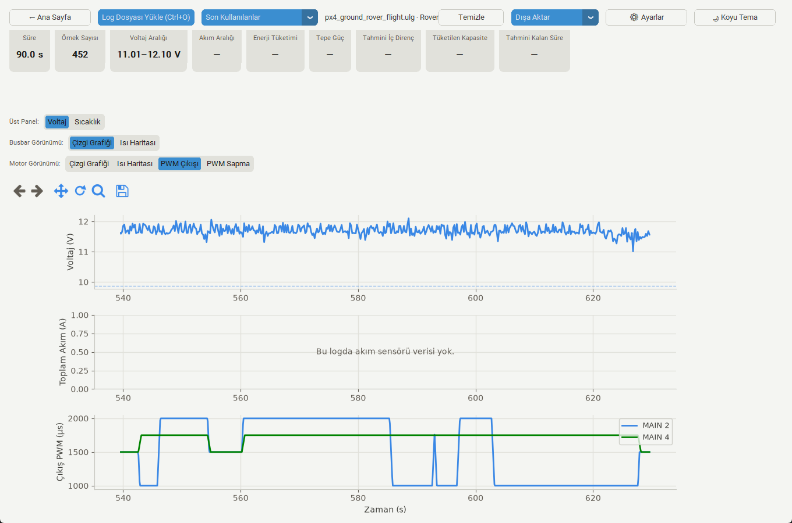
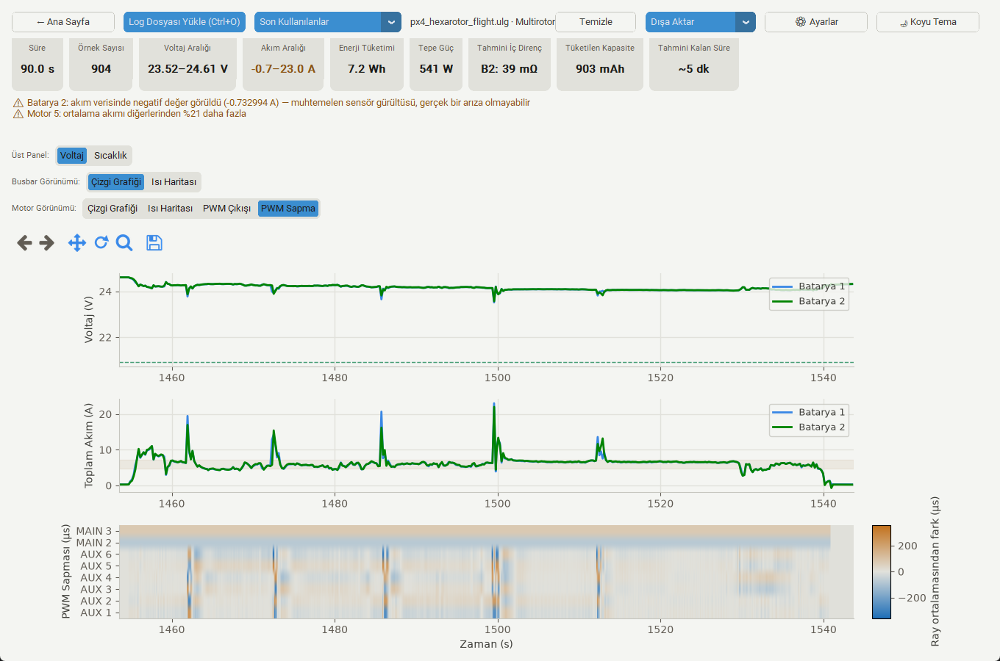
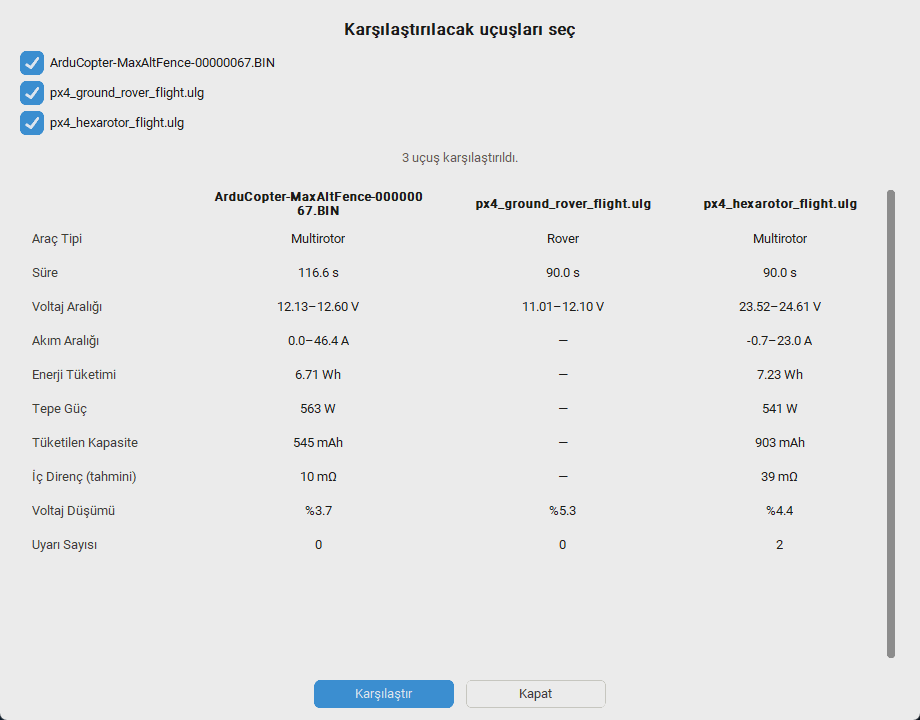

# İHA Güç/Telemetri Log Analiz Aracı

[](https://github.com/berkeaygunnn/-iha-guc-telemetri-log-analiz/actions/workflows/tests.yml)

ArduPilot (`.bin`) veya PX4 (`.ulog`/`.ulg` — PX4 araçları genelde `.ulg`
uzantısıyla üretir, ikisi de aynı ULog formatıdır) uçuş kontrolcülerinden alınan
uçuş sonrası log dosyalarını okuyup; batarya voltaj düşümünü (voltage sag),
motor/ESC akım çekimini ve çıkış kanallarının PWM'ini grafiklere, ısı
haritalarına ve otomatik uyarılara dönüştüren bir masaüstü uygulaması.

Multirotor, sabit kanat, rover ve VTOL loglarıyla çalışır; akım sensörü
bulunmayan araçlarda "ölçüm yok" ile "ölçüm sıfır"ı ayırt eder.



*Gerçek bir PX4 hexarotor uçuşu: özet istatistikler, otomatik uyarılar ve
ortak zaman eksenini paylaşan voltaj / toplam akım / motor akımı panelleri.*

## Özellikler

### Log okuma

- **ArduPilot `.bin` desteği** — kendini tanımlayan (FMT mesajlı) ikili format;
  batarya (`BAT`/`CURR`), motor (`ESC`) ve çıkış kanalı (`RCOU`) mesajlarını çözer.
- **PX4 `.ulog` desteği** — Format/Subscription/Data mesaj yapısını çözer;
  `battery_status`, iç içe dizili `esc_status`/`esc_report`, `actuator_outputs`
  ve `vehicle_status` verisini okur.
- Log formatı dosya içeriğinden (magic byte) otomatik algılanır; kullanıcı
  format seçmek zorunda değildir.
- **Araç tipi tespiti** — rover, sabit kanat, multirotor, VTOL... PX4'te
  `vehicle_status`, ArduPilot'ta firmware adından çıkarılır ve dosya adının
  yanında etiket olarak gösterilir.
- **"Ölçüm yok" ile "ölçüm sıfır" ayrımı** — akım sensörü bağlı değilken uçuş
  kontrolcüsü alanı boş bırakmaz, her örneğe tam 0.0 yazar. Bu durum tespit
  edilir; ilgili paneller düz sıfır çizgisi yerine açık bir mesaj, istatistik
  kutucukları da `0` yerine `—` gösterir (bkz. `has_current_data`).



*Akım sensörü bulunmayan bir rover: akıma dayanan tüm kutucuklar `—`, akım
paneli nedenini yazıyor — ama voltaj gerçek ölçüm olduğu için çiziliyor ve
PWM çıkışı motorun ne yaptığını yine de gösteriyor.*

### Görselleştirme

- Voltaj, toplam akım ve motor verisi ayrı panellerde, ortak zaman eksenini
  paylaşarak çizilir. Birden fazla batarya (ör. ana + yedek güç kaynağı)
  paneller arasında tutarlı renklerle gösterilir.
- **Üst panel:** batarya voltajı ↔ batarya sıcaklığı arasında geçiş.
- **Toplam akım paneli:** çizgi grafiği ↔ batarya × zaman ısı haritası. Yedekli
  güç hattı varsa hangi busbar'ın ne zaman daha yüklü olduğunu gösterir.
- **Motor paneli, dört görünüm:**
  - *Çizgi grafiği* — motor başına akım
  - *Isı haritası* — motor × zaman akım yoğunluğu
  - *PWM çıkışı* — kontrolcünün çıkış kanallarına verdiği darbe genişliği
    (akım sensörü olmayan araçlarda motor aktivitesinin tek görünür kanıtı)
  - *PWM sapma* — her kanalın, aynı çıkış rayındaki (MAIN/AUX) kanalların o
    andaki ortalamasından farkı; kanallar arası dengesizliği görünür kılar
- Özet istatistik satırı: süre, örnek sayısı, voltaj/akım aralığı, enerji
  tüketimi (Wh), tepe güç (W), tahmini iç direnç (mΩ), tüketilen kapasite
  (mAh) ve tahmini kalan süre.
- Yakınlaştırma/kaydırma araç çubuğu (kalıcı pan, tek tuşla görünüm sıfırlama)
  ve imlecin altındaki değeri gösteren tooltip — çizgi grafiklerinde en yakın
  örnek, ısı haritalarında ise imlecin üstündeki hücre (hangi motor/batarya/
  kanal, hangi an, hangi değer).
- **Açık/koyu tema** arasında canlı geçiş — pencere kapanıp açılmaz, tercih
  kalıcıdır.



*PWM sapma görünümü: her kanalın, aynı çıkış rayındaki kanalların o andaki
ortalamasından farkı. Mutlak PWM skalası denendi ve okunaksız çıktı — servo
kanalları skalayı domine edip motorlar arasındaki farkı siliyordu.*

### Analiz ve uyarılar

Kural tabanlı, gerçek loglarla kalibre edilmiş eşiklerle otomatik uyarılar
(yapay zekâ/ML yok — bkz. `shared/power_log_schema.md`'deki `warnings`):

- Batarya voltaj düşümü (varsayılan %15+)
- Motorlar arası akım dengesizliği (varsayılan %20+)
- Bataryalar arası akım dengesizliği (yedekli hatlar için)
- Negatif akım — veri kalitesi işareti (fiziksel olarak beklenmez)

Eşikler **Ayarlar** penceresinden değiştirilebilir ve **araç tipi başına ayrı
ayrı** saklanabilir; grafikteki eşik çizgileri her zaman üretilen uyarıyla
aynı değeri kullanır.

### Karşılaştırma ve dışa aktarma

- **Çoklu uçuş karşılaştırma** — geçmiş dosyalardan 2+ uçuş işaretlenip özet
  metrikleri (araç tipi, süre, voltaj/akım aralığı, enerji, tepe güç,
  kapasite, iç direnç, voltaj düşümü, uyarı sayısı) yan yana tabloda görülür.
- **PNG** (grafik), **PDF** (istatistik + uyarı + grafik raporu) ve **CSV**
  (ham zaman serileri) olarak dışa aktarma.



*Üç farklı aracın uçuşu yan yana. Grafik yerine tablo, çünkü logların zaman
eksenleri örtüşmüyor ve batarya sınıfları farklı (3S/6S); özet metrikler ise
ölçekten bağımsız karşılaştırılabiliyor.*

### Kullanım kolaylıkları

- Açılışta canlı renkli bir **karşılama ekranı**: solda geçmiş dosyalar
  (format rozeti, ne zaman açıldığı, uçuş süresiyle), ortada "Dosya Yükle".
- Son kullanılan dosyalar (en fazla 5) kalıcıdır; uygulama kapanıp açılınca
  korunur ve açılır listeden tek tıkla yüklenir.
- **Temizle** butonuyla ekranı sıfırlayıp temiz bir durumdan başlama.
- Üst araç çubuğu ve istatistik satırı pencere genişliğine uyum sağlar: yer
  kalmayınca butonlar ve kutucuklar alt satıra iner, uzun dosya adları
  kısaltılıp tamamı fare ipucunda gösterilir — hiçbiri ekran dışında kalmaz.
- Klavye kısayolları: Ctrl+O (dosya yükle), Ctrl+S (grafiği PNG kaydet).

## Mimari

İki dilli (polyglot), dosya tabanlı haberleşme (JSON üzerinden):

| Klasör | Görev |
|---|---|
| `backend/` | C++ (CMake). Log dosyasını parse edip `shared/` şemasına uygun JSON üretir. |
| `frontend/` | Python + CustomTkinter + Matplotlib. Dosya seçimi, backend'i çalıştırma, grafik çizimi. |
| `shared/` | Backend ↔ frontend arasındaki JSON veri sözleşmesi (şema + örnek). |
| `data/` | Test için örnek/sentetik uçuş logları (ArduCopter, ArduRover, ArduPlane, PX4 hexarotor/rover/sabit kanat/VTOL). |

Backend ve frontend bağımsız çalışır; aralarında doğrudan bir çağrı yoktur,
sadece dosya üzerinden JSON alışverişi vardır.

Örnek logların kaynağı: `.ulg` dosyaları PX4'ün herkese açık flight review
veritabanından (gerçek donanımlı uçuşlar), `.BIN` dosyaları ArduPilot'un
autotest arşivinden (gerçek firmware, SITL koşusu — format birebir doğru,
sayılar simüle). `synthetic_*` dosyaları testler için elle üretilmiştir.

## Kurulum ve çalıştırma

### Backend'i derleme

```
cd backend
cmake -S . -B build -G "Ninja"
cmake --build build
```

> Not: CMake'in varsayılan "MinGW Makefiles" generator'ı, yol adında Türkçe/Unicode
> karakter (ör. `İ`, `ü`) varsa hataya düşebilir. `Ninja` generator'ı bu sorunu yaşamaz.

### Frontend'i çalıştırma

```
cd frontend
pip install -r requirements.txt
python main.py
```

Açılan pencerede **Log Dosyası Yükle** ile `data/` klasöründeki örnek
loglardan birini (ya da kendi `.bin`/`.ulog`/`.ulg` dosyanı) seç.

## Dağıtım (paketleme)

Geliştirici olmayan biri Python/CMake kurmadan uygulamayı kullanabilsin diye,
frontend PyInstaller ile tek bir klasöre (`.exe` + gerekli her şey) paketlenebilir:

```
.\scripts\build_release.ps1
```

Bu script backend'i derler, sonra `frontend/power_log_frontend.spec` dosyasına
göre paketler. Sonuç: `dist/iha_guc_telemetri_analiz/` klasörü — bu klasörü
olduğu gibi zip'leyip paylaşabilirsin; kullanıcı sadece içindeki
`iha_guc_telemetri_analiz.exe`'yi çalıştırır (backend'in derlenmiş hâli aynı
klasörde bulunduğu için ayrıca CMake/Ninja kurmasına gerek yoktur).

Not: paket örnek `data/` log dosyalarını içermez — küçük kalması için;
kullanıcı kendi `.bin`/`.ulog`/`.ulg` dosyasını yükler.

## Proje durumu

- [x] Python UI iskeleti
- [x] ArduPilot `.bin` parser'ı (batarya + motor/ESC + RCOU)
- [x] PX4 `.ulog` parser'ı (batarya + esc_status + actuator_outputs + vehicle_status)
- [x] Gerçek ve sentetik loglarla uçtan uca test
- [x] Güç dağıtım (busbar) ısı haritası
- [x] Birden fazla batarya desteği
- [x] Kural tabanlı otomatik uyarı sistemi (4 kural, ayarlanabilir eşikler)
- [x] Batarya sıcaklığı, enerji/kapasite ve iç direnç istatistikleri
- [x] Açık/koyu tema (canlı geçiş)
- [x] PNG / PDF / CSV dışa aktarma
- [x] Rover ve sabit kanat desteği (araç tipi tespiti, akım sensörü yokluğu),
      hem PX4 hem ArduPilot tarafı gerçek loglarla doğrulandı
- [x] PWM çıkış ve PWM sapma panelleri
- [x] Araç tipi başına uyarı eşikleri
- [x] Çoklu uçuş karşılaştırma
- [x] PyInstaller ile paketleme (tek klasörlük dağıtım)

Testler: `python backend/tests/run_tests.py` (parser + uyarı kuralları) ve
`python frontend/tests/test_smoke.py` (arayüz duman testleri).

## Lisans

MIT — bkz. [LICENSE](LICENSE).
